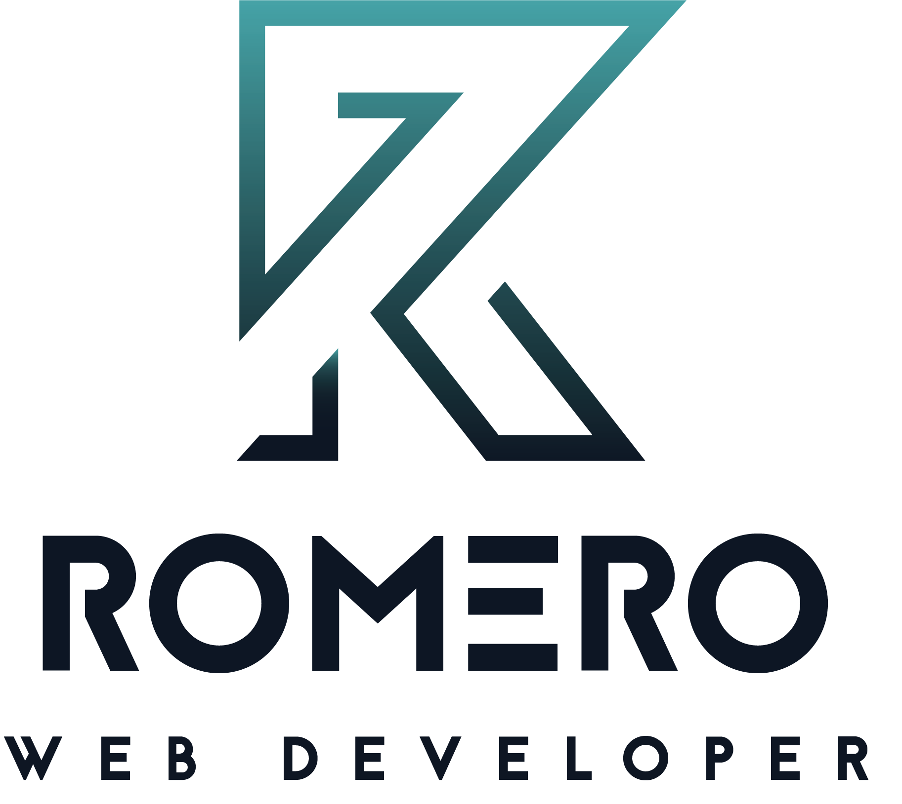
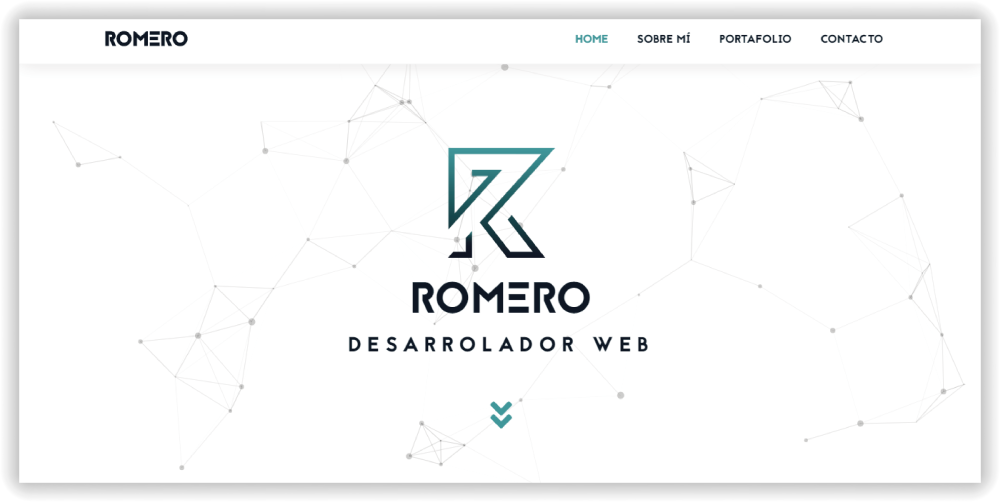
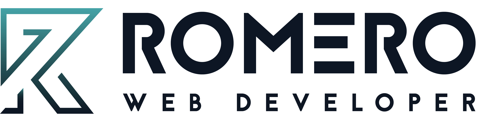

<p align="center"></p>

<p align="center">
Te doy la bienvenida a mi repositorio, puedes usar este contenido con total libertad, siempre teniendo el mayor respeto por los autores que desarrollaron el proyecto.
</p>
<p align="center">
<a href="#titulo-del-proyecto"></a>
<a target="_blank" href="https://packagist.org/packages/laravel/framework"></a>
<a href="https://packagist.org/packages/laravel/framework"></a>
<a href="https://packagist.org/packages/laravel/framework"></a>
</p>

<br>

# Sitio Web: Romero José

Soy Romero Desarrollador Web autodidacta de Venezuela y uno de los proyectos más importantes es el que estás viendo ahora mismo, que se trata de mi sitio web y mi carta de presentación, quería algo ligero, optimizado para los buscadores y agradable a usuario.

<br>

## [Prueba en Vivo](https://romerojose.com/) 


<br><br>

## Usa el proyecto

Para usar cualquier proyecto desde tu ordenador siempre debes tener en cuenta los requisitos minimos para ejecutar este en el mejor ambiente posible, y para eso es bueno prestar atenciuon a las recomendaciones.

### Prerequisites

Necesitas tener los siguientes programas o tecnologias instaladas para poder ejecutar el proyecto.

- **[Google Chrome](https://vehikl.com/)**
- **[Tighten Co.](https://tighten.co)**


### Instalar

Para este proyecto necesitaras clonar este repositorio o descargarlo a tu ordenador.

```
$ npm install
$ npm run dev
```

<br><br>

## Deployment

To deploy simply run

```
npm run build
```

<br><br>

## Built With

- [HTML](https://reactjs.org/)
- [CSS](https://github.com/ReactTraining/react-router)
- [PHP](https://redux.js.org/)
- [Laravel](https://github.com/reduxjs/redux-thunk)
- [MySql](https://www.styled-components.com)

<br><br>

## Authors

<p align="center"></p>

<p align="center">
  Todos los proyectos necesitan un lema de entrada para poder enamorar al usuario y convencerlos de que es necesario.
</p>
<p align="center">
<a href="#titulo-del-proyecto"></a>
<a target="_blank" href="https://packagist.org/packages/laravel/framework"></a>
<a href="https://packagist.org/packages/laravel/framework"></a>
<a href="https://packagist.org/packages/laravel/framework"></a>
<a href="https://packagist.org/packages/laravel/framework"></a>
<a href="https://packagist.org/packages/laravel/framework"></a>
</p>
